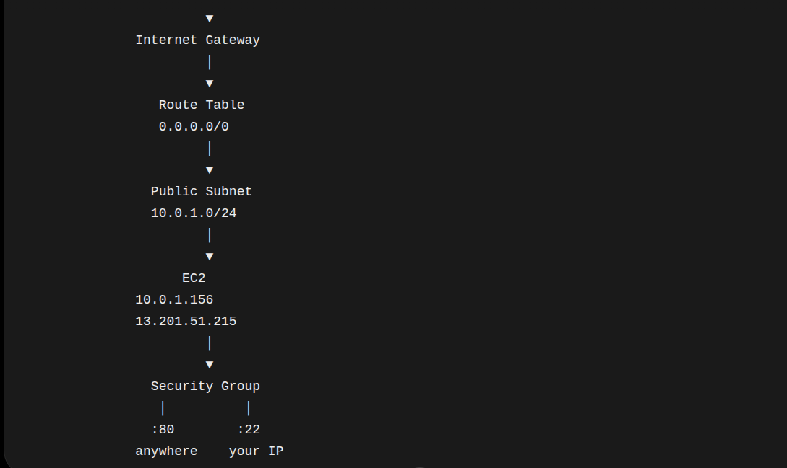
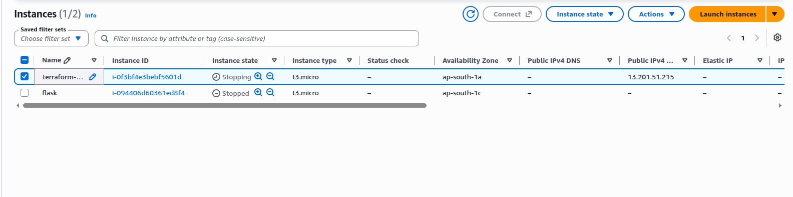
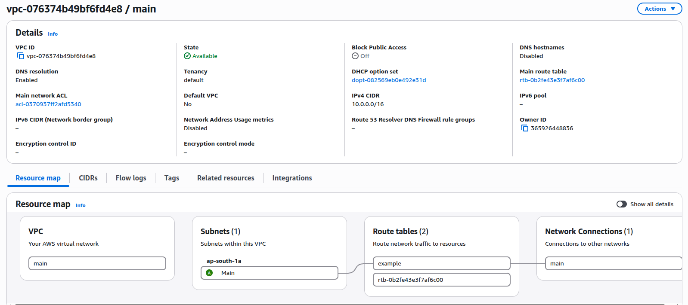

# Terraform + AWS EC2 Infrastructure

A hands-on AWS infrastructure project built using **Terraform**, provisioning a VPC, public subnet, Internet Gateway, route table, Security Group, and EC2 instance. The infrastructure was created and verified directly in AWS using Terraform.

## 1. Terraform Core Concepts

### What Terraform does

Terraform compares **what you declared in `.tf` files** with **what currently exists**, then determines what actions are required to make reality match your configuration.

```text
Configuration (.tf)
        ↓
Terraform compares
        ↓
Current infrastructure + State
        ↓
Create / Change / Destroy
```

### Core building blocks

| Concept | Meaning |
|---|---|
| **Provider** | Tells Terraform **HOW** to communicate with a platform. |
| **Resource** | Defines **WHAT infrastructure** Terraform should create/manage. |
| **Variable** | Allows values to be reused instead of hardcoding them. |
| **Output** | Displays useful information after infrastructure is created. |
| **Data Source** | Reads/finds something that already exists. |
| **Module** | Reusable collection of Terraform code. |
| **State** | Records information about infrastructure Terraform manages. |

### Resource vs Data Source

```hcl
resource "aws_vpc" "main" {
  cidr_block = "10.0.0.0/16"
}
```

**Resource → create/manage**

```hcl
data "aws_vpc" "default" {
  default = true
}
```

**Data source → read/find**

You are telling Terraform:

> "Find the existing default VPC. I don't want Terraform to create it."

Then:

```hcl
vpc_id = data.aws_vpc.default.id
```

**Interview distinction:** `resource` creates/manages; `data` reads/finds.

### Variables

Variables prevent hardcoding values.

```hcl
variable "instance_type" {
  default = "t3.micro"
}

instance_type = var.instance_type
```

### Outputs

Outputs expose useful resource attributes:

```hcl
output "public_ip" {
  value = aws_instance.web.public_ip
}
```

`aws_instance.web.public_ip` is a **resource reference**:

> Take the `public_ip` attribute from the EC2 resource named `web` and expose it as a Terraform output.

Use:

```bash
terraform output
terraform output public_ip
```

---

## 2. Terraform Dependency Graph

Terraform automatically builds a dependency graph from resource references.

Example:

```hcl
vpc_id = aws_vpc.main.id
```

This tells Terraform:

```text
VPC
 ↓
Subnet
```

The subnet depends on the VPC.

You **do not manually define the creation order**. Terraform determines it from dependencies.

Example in this project:

```text
VPC
 ├── Subnet
 ├── Internet Gateway
 └── Security Group

Subnet
 └── Route Table Association

EC2
 ├── Subnet
 └── Security Group
```

---

## 3. Terraform Commands

```bash
terraform init       # Initialize Terraform/providers
terraform fmt        # Format configuration
terraform validate   # Check configuration syntax/validity
terraform plan       # Preview changes
terraform apply      # Create/change infrastructure
terraform destroy    # Destroy managed infrastructure
terraform state list # List resources tracked in state
terraform show       # Show detailed state
terraform output     # Show defined outputs
```

Typical workflow:

```text
terraform init
      ↓
terraform fmt
      ↓
terraform validate
      ↓
terraform plan
      ↓
terraform apply
```

### Terraform State

State records information about infrastructure Terraform manages.

It is **not simply a backup of your AWS infrastructure**.

Terraform uses state when determining what needs to change.

For example, after six resources were created successfully and EC2 failed, a later `terraform apply` created only the missing EC2:

```text
6 resources → already managed
EC2         → missing
                 ↓
              create only EC2
```

---

# 4. AWS Architecture Built in This Project

```text
                         Internet
                            │
                            ▼
                    Internet Gateway
                            │
                            ▼
                    Public Subnet
                    10.0.1.0/24
                            │
                    ┌───────┴───────┐
                    │     EC2      │
                    │  t3.micro    │
                    │ Private IP   │
                    │ 10.0.1.156   │
                    │ Public IP    │
                    │ 13.201.51.215│
                    └──────────────┘
                            │
                    Security Group
```

The project contains:

- VPC: `10.0.0.0/16`
- Subnet: `10.0.1.0/24`
- AZ: `ap-south-1a`
- Internet Gateway
- Route Table
- Route Table Association
- Security Group
- EC2: `t3.micro`

### Public vs Private Subnet

This EC2 is in a **public subnet** because the subnet's associated route table has:

```text
0.0.0.0/0 → Internet Gateway
```

A public subnet has a route to an Internet Gateway.

A private subnet does not have a direct route to an Internet Gateway.

> A public IP alone does not define a public subnet. The subnet's routing is the key factor.

---

# 5. AWS Networking Components

### Internet Gateway

Provides connectivity between the VPC and the Internet.

### Route Table

Decides **where traffic should go**.

Example:

```text
Destination     Target
0.0.0.0/0   →   Internet Gateway
```

`0.0.0.0/0` means the default route: traffic whose destination does not match a more specific route.

**Important:** A route does not mean "traffic is allowed." It determines the path.

### Security Group

Controls whether traffic is allowed to/from the resource.

> **Interview takeaway:** Route tables determine the traffic path; Security Groups control allowed traffic.

---

# 6. Security Groups

### Ingress vs Egress

- **Ingress** → incoming traffic **to** the resource.
- **Egress** → outgoing traffic **from** the resource.

A Security Group rule mainly defines:

```text
from_port
to_port
protocol
cidr_blocks
```

Example:

```hcl
ingress {
  from_port   = 80
  to_port     = 80
  protocol    = "tcp"
  cidr_blocks = ["0.0.0.0/0"]
}
```

Means:

> Allow TCP traffic to port 80 from any IPv4 address.

### Port ranges

```text
80 → 80     = only port 80
80 → 443    = ports 80 through 443
```

The range is inclusive.

### Protocol

`protocol = "tcp"` means TCP.

It does **not** mean HTTP/HTTPS/SSH. Those are application protocols/services that commonly use TCP ports.

```text
-1 = all protocols
```

### `/32`

```text
45.115.52.151/32
```

`/32` represents one specific IPv4 address.

Useful for restricting SSH access to your own public IP.

### Security Group in this project

```text
Ingress:
TCP 22 → SSH  → 45.115.52.151/32
TCP 80 → HTTP → 0.0.0.0/0

Egress:
All traffic → 0.0.0.0/0
```

Security Groups are attached to resources/network interfaces, not used as a route between the Internet and subnet.

---

# 7. Public IP vs Private IP

The EC2 has:

```text
Private IP → 10.0.1.156
Public IP  → 13.201.51.215
```

### Private IP

Used for communication inside the VPC/private network.

### Public IP

Used for Internet-facing communication, such as SSH from your laptop, when the Security Group permits it.

Do **not** think of the public IP as the IP physically assigned inside the subnet. The EC2's network interface uses its private IP inside the VPC; AWS handles public Internet connectivity/translation.

---

# 8. HTTP Request Flow: Internet → EC2

If a user enters:

```text
http://13.201.51.215
```

the simplified flow is:

```text
User
 ↓
Internet
 ↓
Internet Gateway
 ↓
VPC / EC2 network interface
 ↓
Security Group checks TCP :80
 ↓
Web server on EC2
```

The route table determines the routing path. The Security Group checks whether the traffic is allowed.

Because this project's Security Group allows:

```text
TCP 80 → 0.0.0.0/0
```

the HTTP request can reach the web server.

**Don't describe the Security Group as another network hop.** It filters traffic; it does not route the packet.

---

# 9. EC2 → Internet Flow

For an EC2 in this project's public subnet:

```text
EC2
 ↓
Security Group egress
 ↓
Route Table
0.0.0.0/0 → IGW
 ↓
Internet Gateway
 ↓
Internet
```

The Security Group allows the outbound traffic, while the route table determines where it goes.

---

# 10. Interview Questions — Short Answers

### Q1. What is a Terraform provider?

A provider tells Terraform how to communicate with and manage resources on a platform such as AWS.

### Q2. Resource vs data source?

**Resource:** create/manage infrastructure.  
**Data source:** read/find existing information.

### Q3. Why does Terraform need state?

State records information about managed infrastructure so Terraform can determine what already exists and what changes are required.

### Q4. What does `terraform plan` do?

It previews the changes Terraform intends to make without applying them.

### Q5. Why did Terraform create only one resource on the second apply?

The other six resources were already created and tracked in Terraform state, so only the missing EC2 needed to be created.

### Q6. How does Terraform know resource creation order?

It builds a dependency graph from resource references such as:

```hcl
vpc_id = aws_vpc.main.id
```

### Q7. What makes a subnet public?

A subnet is considered public when its route table has a route to an Internet Gateway.

### Q8. Route Table vs Security Group?

**Route Table:** Where should traffic go?  
**Security Group:** Is the traffic allowed?

### Q9. What does `0.0.0.0/0` mean?

It represents all IPv4 destinations/addresses. Its meaning depends on context: in a route it is the default route; in a security rule it means any IPv4 source/destination allowed by that rule.

### Q10. Why restrict SSH to `/32`?

`/32` represents one IPv4 address, so SSH can be limited to a specific trusted public IP instead of the entire Internet.

### Q11. Why allow HTTP from `0.0.0.0/0`?

A public web server generally needs to accept HTTP requests from users anywhere on the Internet.

### Q12. Is `0.0.0.0/0 → IGW` a security rule?

No. It is a **routing rule**. It tells AWS where matching traffic should go.

### Q13. What is a module?

A reusable collection of Terraform code used to avoid repeating infrastructure definitions.

### Q14. What is the purpose of an output?

To expose useful information from Terraform, such as an EC2 public IP, resource ID, or S3 bucket name.

### Q15. Why doesn't an EC2 need `region` inside the resource?

The AWS provider is configured with the region, for example:

```hcl
provider "aws" {
  region = "ap-south-1"
}
```

Resources use that provider configuration by default.

---

# 11. Remember These 6 Lines

```text
Provider  → HOW Terraform talks to AWS
Resource  → WHAT Terraform creates/manages
Data      → FIND something that already exists
State     → WHAT Terraform knows about managed infrastructure
Route     → WHERE traffic goes
SG        → WHAT traffic is allowed
```

**Core interview mental model:**

```text
Terraform
  → Infrastructure

Route Table
  → Traffic path

Internet Gateway
  → VPC ↔ Internet connectivity

Security Group
  → Traffic filtering

Private IP
  → VPC/internal communication

Public IP
  → Internet-facing communication
```


---

---

# 12. Hands-on Proof

This project was implemented and verified manually in AWS using Terraform.

### 1. Terraform + AWS Architecture



### 2. EC2 Created by Terraform

The EC2 instance was successfully created in `ap-south-1a` with a public IPv4 address.



### 3. VPC Resource Map

The AWS VPC Resource Map confirms the VPC, subnet, route table, and Internet Gateway/network connection created for the project.



### 4. S3 Backend 
Configured S3 Backend to store state in AWS S3 bucket.


